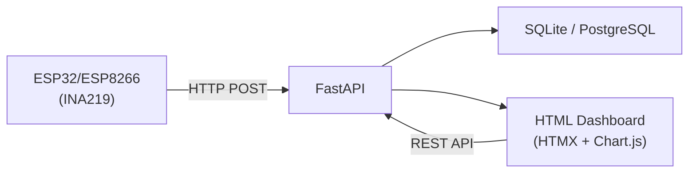

# BuckPow

**Measure. Benchmark. Understand.**

Open-source energy observability and benchmarking platform for low-power edge devices.

**Tech stack:** [FastAPI](https://fastapi.tiangolo.com/) · [SQLAlchemy](https://www.sqlalchemy.org/) · [SQLite](https://www.sqlite.org/) / [PostgreSQL](https://www.postgresql.org/) · [Tailwind CSS](https://tailwindcss.com/) · [HTMX](https://htmx.org/) · [Chart.js](https://www.chartjs.org/)

## What is BuckPow

BuckPow is a self-hosted platform designed to measure, analyze, and benchmark power consumption across low-power DC systems. It helps developers, researchers, makers, and engineers understand how much energy their devices actually consume through reproducible measurements.

Instead of only displaying live telemetry, BuckPow focuses on **energy observability**, allowing users to compare devices, firmware versions, experiments, batteries, and solar-powered systems using real-world data.

Whether you are validating an IoT prototype, optimizing battery life, benchmarking a Raspberry Pi, evaluating a small solar panel, or conducting Green AI research, BuckPow provides a consistent workflow for collecting, visualizing, and comparing energy data.

## Key Features

- Real-time voltage, current, power, and energy monitoring
- Automatic device registration
- Session recording with energy accumulation
- Energy benchmarking and session comparison
- Device API key authentication
- Alerting based on configurable thresholds
- Project organization
- CSV and Excel data export
- Self-hosted deployment with Docker
- REST API for device integration

## Why BuckPow

Most IoT dashboards are built to visualize telemetry.

BuckPow is built to answer engineering questions such as:

- Which device consumes less power?
- Which firmware version is more energy efficient?
- Is my solar panel large enough for this system?
- How long will my battery last?
- How much energy does an OTA update consume?
- How much energy is required for one AI inference?

BuckPow helps replace assumptions with measurements.

## Typical Use Cases

- Raspberry Pi power benchmarking
- ESP32 and ESP8266 power monitoring
- Battery discharge and runtime testing
- Small solar panel evaluation
- DC power supply validation
- TinyML and Edge AI energy profiling
- Firmware power optimization
- IoT prototype validation
- Engineering laboratory experiments
- Academic energy research

## Supported Hardware

| Current | Planned |
|---------|---------|
| ESP32 | Raspberry Pi Agent |
| ESP8266 | Linux Agent |
| INA219 | INA226 |
| | PZEM-004T |
| | MQTT devices |
| | Additional DC power sensors |

## Screenshot


## Architecture



Power sensors collect measurements from edge devices and send them to the BuckPow API. The API stores measurements, processes sessions and benchmarks, and serves a web dashboard for visualization and analysis.

## Installation with Docker Compose

### Prerequisites

- [Docker](https://docs.docker.com/get-docker/)
- [Docker Compose](https://docs.docker.com/compose/install/)

### Quick start

```bash
git clone https://github.com/arifnd/buckpow.git
cd buckpow
docker compose up -d
```

This starts PostgreSQL, BuckPow on port 8000, and Nginx.

### Configuration

Create a `.env` file (or copy `.env.example`):

```env
APP_ENV=production
SECRET_KEY=your-strong-secret-key
DATABASE_URL=postgresql://buckpow:buckpow@db:5432/buckpow
ADMIN_EMAIL=admin@example.com
ADMIN_PASSWORD=your-secure-password
DISABLE_API_DOCS=true
```

Then restart:

```bash
docker compose down
docker compose up -d
```

## Environment Variables

| Variable | Default | Description |
|---|---|---|
| `APP_ENV` | `development` | Environment mode |
| `SECRET_KEY` | `buckpow-dev-key-...` | JWT signing key (set in production) |
| `APP_HOST` | `0.0.0.0` | Server bind address |
| `APP_PORT` | `8000` | Server port |
| `DATABASE_URL` | SQLite (`instance/buckpow.db`) | Database connection string |
| `ADMIN_EMAIL` | (empty) | Auto-create admin on first run |
| `ADMIN_PASSWORD` | (empty) | Admin password |
| `DEVICE_ONLINE_TIMEOUT` | `30` | Seconds before marking device offline |
| `DEFAULT_SAMPLING_INTERVAL` | `1` | Default interval (seconds) for new devices |
| `LOG_LEVEL` | `info` | Logging level |
| `DISABLE_API_DOCS` | `false` | Set to `true` to disable `/docs` and `/redoc` |


## How to Run (without Docker)

### Development

```bash
python3 -m venv venv
source venv/bin/activate
pip install -r requirements.txt
fastapi dev app/main.py --port 8000
```

Open http://localhost:8000. Tables auto-create on first run (SQLite).  
Default admin credentials come from `ADMIN_EMAIL` and `ADMIN_PASSWORD` env vars (auto-created on first run if both are set).

### Production

```bash
fastapi run app/main.py --port 8000 --proxy-headers
```

For PostgreSQL, run migrations first:

```bash
alembic upgrade head
fastapi run app/main.py
```

### Database Migrations

```bash
alembic revision --autogenerate -m "description"
alembic upgrade head
```

## API Documentation

When `DISABLE_API_DOCS` is not set, interactive docs are available at:

- **Swagger UI** — [/docs](http://localhost:8000/docs)
- **ReDoc** — [/redoc](http://localhost:8000/redoc)
- **OpenAPI JSON** — [/openapi.json](http://localhost:8000/openapi.json)

### Endpoints

| Method | Path | Auth | Description |
|--------|------|------|-------------|
| POST | `/api/v1/measurements` | API key | Send a reading from ESP device |
| GET | `/api/v1/measurements` | User | Paginated readings |
| GET | `/api/v1/measurements/export/csv` | User | Export as CSV |
| GET | `/api/v1/measurements/export/xlsx` | User | Export as Excel |
| GET | `/api/v1/dashboard` | — | Latest + stats + devices |
| GET | `/api/v1/dashboard/summary` | — | Online/offline count, active sessions, today energy |
| GET | `/api/v1/dashboard/statistics` | — | Full stats with energy breakdown |
| GET | `/api/v1/chart` | — | Chart data (device/session filter, granularity) |
| GET/POST | `/api/v1/devices` | User | List / create devices |
| GET/PUT/DELETE | `/api/v1/devices/<id>` | User | Device CRUD |
| PATCH | `/api/v1/devices/<id>/toggle` | User | Enable/disable device |
| POST | `/api/v1/devices/<id>/regenerate-key` | User | Generate new API key |
| GET/POST | `/api/v1/sessions` | User | List / create sessions |
| GET/PUT/DELETE | `/api/v1/sessions/<id>` | User | Session CRUD |
| POST | `/api/v1/sessions/<id>/start` | User | Start session |
| POST | `/api/v1/sessions/<id>/stop` | User | Stop session |
| GET/POST | `/api/v1/projects` | User | List / create projects |
| GET/PUT/DELETE | `/api/v1/projects/<id>` | User | Project CRUD |
| GET/POST | `/api/v1/alerts` | User | List / create alerts |
| PATCH | `/api/v1/alerts/<id>/resolve` | User | Resolve alert |
| POST | `/api/v1/alerts/resolve-all` | User | Resolve all unresolved |
| GET | `/api/v1/benchmark/compare` | User | Compare 2–3 sessions |
| POST | `/api/v1/auth/login` | — | Email/password login |
| POST | `/api/v1/auth/logout` | User | Logout |
| GET | `/api/v1/auth/me` | User | Current user info |
| PUT | `/api/v1/auth/profile` | User | Update profile |
| GET/PUT | `/api/v1/settings` | User | Get / update settings |
| GET | `/api/v1/health` | — | Health check |

### Send a reading

```bash
curl -X POST http://localhost:8000/api/v1/measurements \
  -H 'Content-Type: application/json' \
  -H 'Authorization: Bearer <api_key>' \
  -d '{"device_id":"esp32-01","bus_voltage":5.12,"shunt_voltage":82,"current":241,"power":1234}'
```

API key is optional when authentication is disabled (dev mode). Get the key from the device detail page.

### Dashboard pages

| Path | Page |
|------|------|
| `/` | Dashboard with real-time charts & summary cards |
| `/devices` | Device management |
| `/devices/new` | Create device form |
| `/devices/<id>/edit` | Edit device form |
| `/sessions` | Session management |
| `/sessions/new` | Create session form |
| `/sessions/<id>/edit` | Edit session form |
| `/measurements` | Paginated readings with date range filter |
| `/projects` | Project management |
| `/benchmark` | Session comparison |
| `/alerts` | Alert management |
| `/settings` | User preferences |
| `/profile` | Profile editing |
| `/auth/login` | Login page |

## Testing

```bash
python -m pytest tests/ -v
```

### Send dummy data

```bash
python scripts/send_dummy.py --interval 1
python scripts/send_dummy.py --interval 1 --api-key <key>
```

## License

MIT
