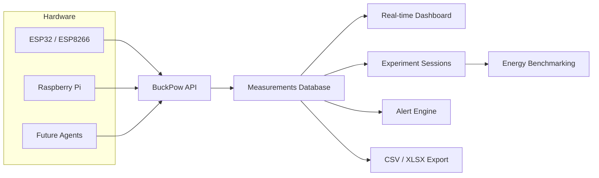

# BuckPow

**Measure. Benchmark. Understand.**

Open-source energy observability and benchmarking platform for low-power edge devices.


## What is BuckPow

BuckPow is a self-hosted platform for measuring, analyzing, and benchmarking energy consumption across low-power DC systems.

Unlike traditional IoT dashboards that only display live telemetry, BuckPow treats every measurement as part of an engineering experiment. Measurements are organized into sessions, allowing developers and researchers to compare hardware, firmware, batteries, operating modes, and workloads using reproducible real-world data.

BuckPow is designed for developers, researchers, makers, engineers, and educators who need accurate energy measurements rather than simple monitoring.

Whether you are validating an IoT prototype, optimizing battery life, benchmarking a Raspberry Pi, evaluating a solar-powered system, profiling TinyML applications, or conducting Green AI research, BuckPow provides a complete workflow for collecting, visualizing, and comparing energy data.

## Key Features

- Real-time voltage, current, power, and energy monitoring
- Automatic device registration
- Session recording with energy accumulation
- Energy benchmarking and session comparison
- Device API key authentication
- Alerting based on configurable thresholds
- Project organization
- CSV and Excel data export
- Self-hosted deployment with Docker
- REST API for device integration

## Why BuckPow

Most IoT dashboards are built to visualize telemetry.

BuckPow is built to answer engineering questions such as:

- Which device consumes less power?
- Which firmware version is more energy efficient?
- Is my solar panel large enough for this system?
- How long will my battery last?
- How much energy does an OTA update consume?
- How much energy is required for one AI inference?

BuckPow helps replace assumptions with measurements.

## Typical Use Cases

- Raspberry Pi power benchmarking
- ESP32 and ESP8266 power monitoring
- Battery discharge and runtime testing
- Small solar panel evaluation
- DC power supply validation
- TinyML and Edge AI energy profiling
- Firmware power optimization
- IoT prototype validation
- Engineering laboratory experiments
- Academic energy research

## Supported Hardware

| Current | Planned |
|---------|---------|
| ESP32 | Raspberry Pi Agent |
| ESP8266 | Linux Agent |
| INA219 | INA226 |
| | PZEM-004T |
| | MQTT devices |
| | Additional DC power sensors |

## Screenshot


## Architecture



Power sensors collect measurements from edge devices and send them to the BuckPow API. The API stores measurements, processes sessions and benchmarks, and serves a web dashboard for visualization and analysis.

## Installation with Docker Compose

### Prerequisites

- [Docker](https://docs.docker.com/get-docker/)
- [Docker Compose](https://docs.docker.com/compose/install/)

### Quick start

```bash
git clone https://github.com/arifnd/buckpow.git
cd buckpow
docker compose up -d
```

This starts PostgreSQL, BuckPow on port 8000, and Nginx.

### Configuration

Create a `.env` file (or copy `.env.example`):

```env
APP_ENV=production
JWT_SECRET=your-strong-secret-key
DATABASE_URL=postgresql://buckpow:buckpow@db:5432/buckpow
ADMIN_EMAIL=admin@example.com
ADMIN_PASSWORD=your-secure-password
DISABLE_API_DOCS=true
```

Then restart:

```bash
docker compose down
docker compose up -d
```

## Environment Variables

| Variable | Default | Description |
|---|---|---|
| `APP_ENV` | `development` | Environment mode |
| `JWT_SECRET` | `buckpow-dev-key-...` | JWT signing key (set in production) |
| `APP_HOST` | `0.0.0.0` | Server bind address |
| `APP_PORT` | `8000` | Server port |
| `DATABASE_URL` | SQLite (`instance/buckpow.db`) | Database connection string |
| `ADMIN_EMAIL` | (empty) | Auto-create admin on first run |
| `ADMIN_PASSWORD` | (empty) | Admin password |
| `DEVICE_ONLINE_TIMEOUT` | `30` | Seconds before marking device offline |
| `DEFAULT_SAMPLING_INTERVAL` | `1` | Default interval (seconds) for new devices |
| `LOG_LEVEL` | `info` | Logging level |
| `DISABLE_API_DOCS` | `false` | Set to `true` to disable `/docs` and `/redoc` |


## How to Run (without Docker)

### Development

```bash
python3 -m venv venv
source venv/bin/activate
pip install -r requirements.txt
fastapi dev app/main.py --port 8000
```

Tables are automatically created on first startup when using SQLite.

The administrator account is automatically created if `ADMIN_EMAIL` and `ADMIN_PASSWORD` are configured.

### Production

Run database migrations.

```bash
alembic upgrade head
```

Start the application.

```bash
fastapi run app/main.py --proxy-headers
```

## API Documentation

When `DISABLE_API_DOCS` is not set, interactive docs are available at:

- **Swagger UI** — [/docs](http://localhost:8000/docs)
- **ReDoc** — [/redoc](http://localhost:8000/redoc)
- **OpenAPI JSON** — [/openapi.json](http://localhost:8000/openapi.json)

## REST API

BuckPow provides REST APIs for:

- Authentication
- Device management
- Measurement ingestion
- Session management
- Projects
- Alerts
- Benchmarking
- Dashboard statistics
- Settings
- Audit logs
- Health monitoring

See the OpenAPI documentation for the complete API reference.

## Sending Measurements

Example:

```bash
curl -X POST http://localhost:8000/api/v1/measurements \
  -H 'Content-Type: application/json' \
  -H 'Authorization: Bearer <api_key>' \
  -d '{"device_id":"esp32-01","bus_voltage":5.12,"shunt_voltage":82,"current":241,"power":1234}'
```

API key is optional when authentication is disabled (dev mode). Get the key from the device detail page.

## Dashboard Pages

- Dashboard
- Devices
- Sessions
- Measurements
- Projects
- Benchmark
- Alerts
- Audit Log
- Settings
- User Profile

## Testing

Run the test suite.

```bash
python -m pytest tests/ -v
```

### Send dummy data

Generate dummy measurements.

```bash
python scripts/send_dummy.py --interval 1 --api-key <key>
```

## Contributing

Contributions are welcome.

Bug reports, feature requests, documentation improvements, and pull requests are greatly appreciated.

Please open an issue before submitting large changes to discuss the proposed implementation.

## License

MIT License
