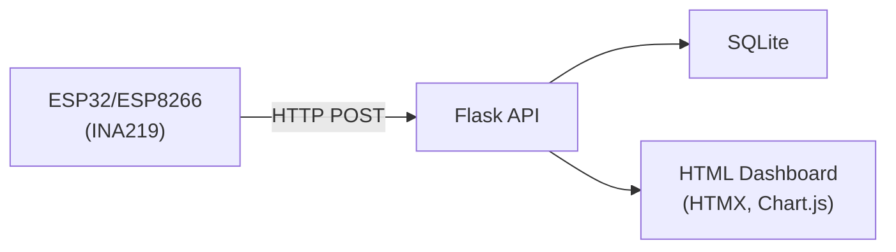

# BuckPow

ESP32/ESP8266 power meter dashboard.

**Tech stack:** [Flask](https://flask.palletsprojects.com/) · [SQLAlchemy](https://www.sqlalchemy.org/) · [SQLite](https://www.sqlite.org/) · [Tailwind CSS](https://tailwindcss.com/) · [HTMX](https://htmx.org/) · [Chart.js](https://www.chartjs.org/)

## Features

- **Real-time power monitoring** — live voltage, current, power & energy dashboard
- **Device auto-registration** — new ESP32/ESP8266 devices register on first reading
- **Session management** — start/stop recording sessions with automatic energy accumulation (Wh)
- **Device API keys** — per-device authentication with key generation & rotation
- **Alerting engine** — configurable thresholds for high power, high current, low voltage
- **Benchmarking** — compare sessions side-by-side with statistical summaries
- **Projects** — organize devices and sessions into projects
- **Data export** — CSV and XLSX export with date range filtering
- **Dark theme** — system/light/dark mode with user preference persistence
- **Pagination** — all list views paginated at 10 items/page
- **Docker ready** — PostgreSQL + Nginx production stack via docker-compose



## Setup

```bash
python3 -m venv venv
source venv/bin/activate
pip install -r requirements.txt
flask db upgrade
```

## Run

```bash
python run.py
```

Open http://localhost:5001. (Port 5000 is often taken by macOS AirPlay — `.env` defaults to 5001.)

## API

| Method | Path | Description |
|---|---|---|
| POST | `/api/v1/measurements` | Send a reading |
| GET | `/api/v1/measurements` | Paginated readings (10/page) |
| GET | `/api/v1/measurements/export/csv` | Export filtered readings as CSV |
| GET | `/api/v1/dashboard` | Latest + stats + devices |
| GET | `/api/v1/chart` | Chart data (device/session filter) |
| GET/POST | `/api/v1/devices` | List (paginated) / create devices |
| GET/PUT/DELETE | `/api/v1/devices/<id>` | Device CRUD |
| GET/POST | `/api/v1/sessions` | List (paginated) / create sessions |
| GET/PUT/DELETE | `/api/v1/sessions/<id>` | Session CRUD |
| POST | `/api/v1/sessions/<id>/start` | Start session |
| POST | `/api/v1/sessions/<id>/stop` | Stop session |

### Send a reading

```bash
curl -X POST http://localhost:5001/api/v1/measurements \
  -H 'Content-Type: application/json' \
  -H 'Authorization: Bearer <api_key>' \
  -d '{"device_id":"esp32-01","bus_voltage":5.12,"shunt_voltage":82,"current":241,"power":1234}'
```

> **Note:** API key is optional when authentication is disabled (dev mode). Get the key from the device detail page or via `GET /api/v1/devices/<id>/key`.

## Pages

| Path | Page |
|---|---|
| `/` | Dashboard with real-time charts & summary cards |
| `/devices` | Device management |
| `/sessions` | Session management |
| `/measurements` | Paginated readings with date range filter |

## Test

```bash
python -m pytest tests/ -v
```

## Send dummy data

```bash
python scripts/send_dummy.py --interval 1                               # without API key
python scripts/send_dummy.py --interval 1 --api-key <your_api_key>      # with authentication
```

## Config

`.env` supports `FLASK_HOST`, `FLASK_PORT` (default: 5001), `SECRET_KEY`, `SQLALCHEMY_DATABASE_URI`, `DEVICE_ONLINE_TIMEOUT`.

## License

MIT
