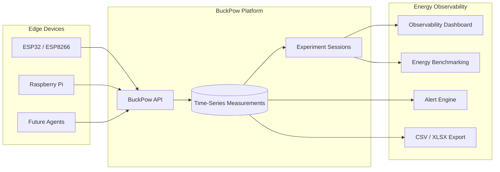

# BuckPow

> **Measure. Observe. Optimize.**

**Open-source energy observability platform for low-power edge devices.**

> BuckPow enables engineers and researchers to measure, organize, benchmark, and analyze energy consumption through reproducible experiments. Instead of treating power measurements as isolated telemetry, BuckPow provides an end-to-end workflow for energy characterization and optimization.


## What is BuckPow

BuckPow is an open-source, self-hosted energy observability platform for low-power edge devices.

Unlike traditional IoT dashboards that focus on displaying live telemetry, BuckPow organizes measurements into reproducible engineering experiments. Every measurement belongs to a session, making it easy to compare hardware platforms, firmware versions, batteries, operating modes, workloads, and deployment scenarios.

BuckPow combines measurement nodes, embedded firmware, REST APIs, and a web-based dashboard into a complete workflow for collecting, visualizing, benchmarking, and analyzing energy consumption.

Whether you are validating an IoT prototype, optimizing battery life, benchmarking embedded Linux systems, profiling TinyML inference, evaluating solar-powered devices, or conducting academic research, BuckPow helps replace assumptions with reproducible measurements.

## Core Capabilities

- Real-time voltage, current, power, and energy characterization
- Automatic device discovery and registration
- Experiment session management
- Multi-device measurement collection
- Interactive observability dashboards
- Energy benchmarking and comparison
- Configurable threshold alerts
- CSV and Excel data export
- RESTful developer API
- Self-hosted Docker deployment

## Why BuckPow

Traditional monitoring platforms answer:

> "What is happening right now?"

BuckPow is designed to answer engineering questions such as:

- Which device consumes less power?
- Which firmware version is more energy efficient?
- Is my solar panel large enough for this system?
- How long will my battery last?
- How much energy does an OTA update consume?
- How much energy is required for one AI inference?

BuckPow helps replace assumptions with measurements.

## Energy Observability

BuckPow is built around the idea that energy should be observable throughout the engineering lifecycle.

**Measure → Observe → Compare → Benchmark → Optimize**

Rather than collecting isolated measurements, BuckPow helps engineers understand how design decisions affect energy consumption and battery lifetime through reproducible experiments.

## Typical Use Cases

- Embedded firmware optimization
- Battery-powered IoT development
- Raspberry Pi benchmarking
- TinyML energy profiling
- Edge AI evaluation
- Solar-powered system characterization
- Engineering laboratory experiments
- Academic energy research

## Supported Hardware

### Measurement Nodes

| Current | Planned |
|---------|---------|
| ESP32 | Raspberry Pi Agent |
| ESP8266 | Linux Agent |

### Supported Sensors

| Current | Planned |
|---------|---------|
| INA219 | INA226 |
| | PZEM-004T |
| | MQTT devices |
| | Additional DC power sensors |

## Screenshot


## Architecture



## Dashboard Pages

- Dashboard
- Devices
- Sessions
- Measurements
- Projects
- Benchmark
- Alerts
- Audit Log
- Settings
- User Profile

## Installation with Docker Compose

### Prerequisites

- [Docker](https://docs.docker.com/get-docker/)
- [Docker Compose](https://docs.docker.com/compose/install/)

### Quick start

```bash
git clone https://github.com/arifnd/buckpow.git
cd buckpow
docker compose up -d
```

This starts PostgreSQL, BuckPow on port 8000, and Nginx.

### Configuration

Create a `.env` file (or copy `.env.example`):

```env
APP_ENV=production
JWT_SECRET=your-strong-secret-key
DATABASE_URL=postgresql://buckpow:buckpow@db:5432/buckpow
ADMIN_EMAIL=admin@example.com
ADMIN_PASSWORD=your-secure-password
DISABLE_API_DOCS=true
```

Then restart:

```bash
docker compose down
docker compose up -d
```

## Environment Variables

| Variable | Default | Description |
|---|---|---|
| `APP_ENV` | `development` | Environment mode (`development`, `staging`, `production`) |
| `JWT_SECRET` | `buckpow-dev-key-change-in-production` | JWT signing key (set in production, min 32 chars) |
| `APP_HOST` | `0.0.0.0` | Server bind address |
| `APP_PORT` | `8000` | Server port |
| `DATABASE_URL` | SQLite (`instance/buckpow.db`) | Database connection string |
| `ADMIN_EMAIL` | (empty) | Auto-create admin on first run |
| `ADMIN_PASSWORD` | (empty) | Admin password |
| `DEVICE_ONLINE_TIMEOUT` | `30` | Seconds before marking device offline |
| `DEFAULT_SAMPLING_INTERVAL` | `1` | Default interval (seconds) for new devices |
| `DEVICE_AUTH_ENABLED` | `true` | Require API key for device ingestion |
| `LOG_LEVEL` | `info` | Logging level |
| `DISABLE_API_DOCS` | `false` | Set to `true` to disable `/docs` and `/redoc` |


## How to Run (without Docker)

### Development

```bash
python3 -m venv venv
source venv/bin/activate
pip install -r requirements/dev.txt
fastapi dev src/main.py --port 8000
```

Tables are automatically created on first startup when using SQLite.

The administrator account is automatically created if `ADMIN_EMAIL` and `ADMIN_PASSWORD` are configured.

### Production

Run database migrations.

```bash
alembic upgrade head
```

Start the application.

```bash
fastapi run src/main.py --proxy-headers
```

## API Documentation

When `DISABLE_API_DOCS` is not set, interactive docs are available at:

- **Swagger UI** — [/docs](http://localhost:8000/docs)
- **ReDoc** — [/redoc](http://localhost:8000/redoc)
- **OpenAPI JSON** — [/openapi.json](http://localhost:8000/openapi.json)

## Developer API

BuckPow provides a RESTful developer API for:

- Authentication
- Device management
- Measurement ingestion
- Session management
- Projects
- Alerts
- Benchmarking
- Dashboard statistics
- Settings
- Audit logs
- Health check

See the OpenAPI documentation for the complete API reference.

## Sending Measurements

Example:

```bash
curl -X POST http://localhost:8000/api/v1/measurements \
  -H 'Content-Type: application/json' \
  -H 'Authorization: Bearer <api_key>' \
  -d '{"device_id":"esp32-01","bus_voltage":5.12,"shunt_voltage":82,"current":241,"power":1234}'
```

API key is optional when authentication is disabled (dev mode). Get the key from the device detail page.

## Testing

Run the test suite.

```bash
python -m pytest tests/ -v
```

### Send dummy data

Generate dummy measurements.

```bash
python scripts/send_dummy.py --interval 1 --api-key <key>
```

## Contributing

BuckPow welcomes contributions from engineers, researchers, educators, and makers interested in energy observability for embedded systems.

Whether you improve documentation, firmware, hardware integrations, benchmarking methods, or the web platform, your contributions are appreciated.

Bug reports, feature requests, documentation improvements, and pull requests are greatly appreciated.

Please open an issue before submitting large changes to discuss the proposed implementation.

## License

MIT License
