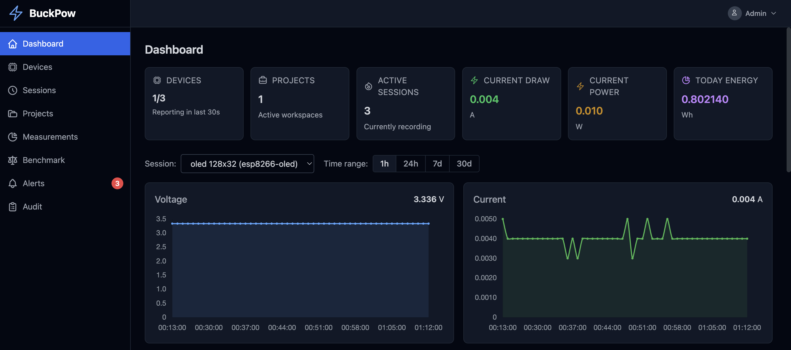
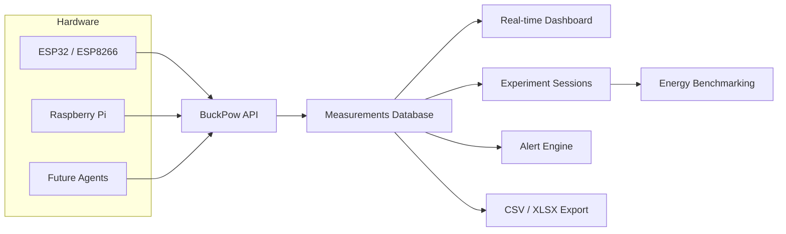

# BuckPow

**Measure. Benchmark. Understand.**

---

BuckPow is an open-source, self-hosted energy observability and benchmarking platform for low-power DC systems.

It collects real-time power measurements from ESP32/ESP8266 sensors, organizes them into experiment sessions, and provides a web dashboard with live charts, energy analysis, and session comparison.

| Layer | Stack |
|-------|-------|
| **Backend** | FastAPI + SQLAlchemy + Alembic |
| **Frontend** | HTMX + Tailwind CSS + Chart.js |
| **Database** | SQLite (default) / PostgreSQL / MySQL |
| **Firmware** | Arduino (ESP32, ESP8266 + INA219) |
| **Deploy** | Docker Compose or standalone |

## Screenshot

{ width="800" }


---

## What BuckPow Does

BuckPow answers engineering questions with real measurements:

- **Which device** consumes less power?
- **Which firmware version** is more energy efficient?
- **Is my solar panel** large enough for this system?
- **How long** will my battery last?
- **How much energy** does an OTA update consume?
- **How much energy** is required for one AI inference?

## Key Features

| Feature | Description |
|---------|-------------|
| **Real-time monitoring** | Voltage, current, power, and energy with live charts |
| **Auto device registration** | Unknown `device_id` values are registered automatically |
| **Session recording** | Organize measurements into timed experiments |
| **Energy benchmarking** | Compare 2-3 sessions side-by-side |
| **Alert engine** | Configurable thresholds per device (high power, high current, low voltage) |
| **Data export** | CSV and Excel with date range filtering |
| **API key auth** | Per-device API keys with masked display |
| **Project organization** | Group devices and sessions by project |
| **Dark theme** | System/light/dark toggle with persistence |
| **Docker deployment** | PostgreSQL + Nginx production stack |

## Architecture



<!-- TODO: Replace with actual architecture diagram -->

Power sensors collect measurements from edge devices and send them to the BuckPow API. The API stores measurements, processes sessions and benchmarks, and serves a web dashboard for visualization and analysis.

## Supported Hardware

| Current | Planned |
|---------|---------|
| ESP32 | Raspberry Pi Agent |
| ESP8266 | Linux Agent |
| INA219 | INA226 |
| | PZEM-004T |
| | MQTT devices |
| | Additional DC power sensors |

## Quick Start

=== "Docker (Recommended)"

    ```bash
    git clone https://github.com/arifnd/buckpow.git
    cd buckpow
    docker compose up -d
    ```

    BuckPow starts on port `8000`. Default admin: `admin@example.com` / `password`.

=== "Local Development"

    ```bash
    git clone https://github.com/arifnd/buckpow.git
    cd buckpow
    python3 -m venv venv
    source venv/bin/activate
    pip install -r requirements.txt
    fastapi dev app/main.py --port 8000
    ```

    Tables auto-create on first run with SQLite.

## Environment Variables

| Variable | Default | Description |
|----------|---------|-------------|
| `APP_ENV` | `development` | `development` or `production` |
| `SECRET_KEY` | `buckpow-dev-key-...` | JWT signing key (required in production) |
| `APP_HOST` | `0.0.0.0` | Server bind address |
| `APP_PORT` | `8000` | Server port |
| `DATABASE_URL` | `sqlite:///instance/buckpow.db` | Database connection string |
| `ADMIN_EMAIL` | *(empty)* | Auto-create admin on first run |
| `ADMIN_PASSWORD` | *(empty)* | Admin password |
| `DEVICE_ONLINE_TIMEOUT` | `30` | Seconds before marking device offline |
| `DEFAULT_SAMPLING_INTERVAL` | `1` | Default interval in seconds |
| `LOG_LEVEL` | `info` | Python logging level |
| `DISABLE_API_DOCS` | `false` | Disable `/docs` and `/redoc` |

## Dashboard Pages

| Page | Description |
|------|-------------|
| [Dashboard](user-guide/dashboard.md) | Real-time charts and summary cards |
| [Devices](user-guide/devices.md) | Device management and API keys |
| [Sessions](user-guide/first-measurement.md) | Experiment session management |
| [Measurements](user-guide/export-data.md) | Paginated readings with date filter |
| [Projects](user-guide/devices.md) | Project organization |
| [Benchmark](user-guide/benchmark.md) | Session comparison |
| [Alerts](user-guide/troubleshooting.md) | Alert management and resolution |
| [Settings](user-guide/installation.md) | Thresholds, theme, timestamps |

## REST API

BuckPow exposes a RESTful API under `/api/v1/` for device integration, data export, and automation.

```bash title="Send a measurement"
curl -X POST http://localhost:8000/api/v1/measurements \
  -H 'Content-Type: application/json' \
  -H 'Authorization: Bearer <api_key>' \
  -d '{
    "device_id": "esp32-01",
    "bus_voltage": 5.12,
    "shunt_voltage": 82,
    "current": 241,
    "power": 1234
  }'
```

See the [API Reference](developer-guide/api.md) for the full endpoint list.

## Next Steps

<div class="grid cards" markdown>

- [**Quick Start**](quick-start.md)
    ---

    Get BuckPow running in 5 minutes.

- [**User Guide**](user-guide/installation.md)
    ---

    End-user documentation for the dashboard, devices, sessions, and more.

- [**Developer Guide**](developer-guide/architecture.md)
    ---

    Architecture, API, database, frontend, backend, and firmware internals.

- [**Blog**](blog/why-buckpow.md)
    ---

    Design decisions, comparisons, and case studies.

</div>

## License

MIT License. See [GitHub Repository](https://github.com/arifnd/buckpow) for details.
