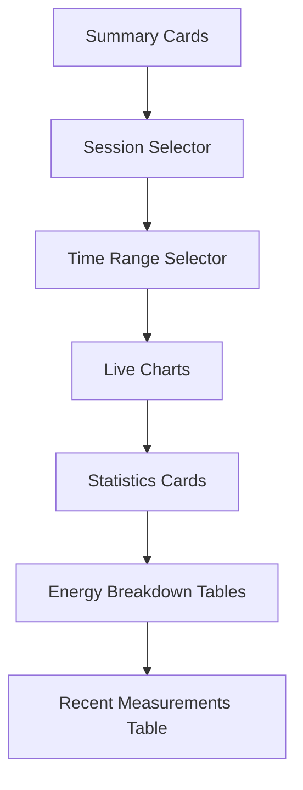

# Dashboard

The main dashboard provides a real-time overview of your power monitoring system.

---

## Overview

{ width="800" }

The dashboard is the first page you see after logging in. It displays:

- Live voltage, current, power, and energy charts
- Summary cards with device status and totals
- Statistics with min/max/avg/peak values
- Energy breakdown by hour, day, week, and month
- Recent measurements table
- Session selector for filtering data

All data refreshes automatically every 5 seconds.

## Layout

## Summary Cards

The top section shows key metrics:

| Card | Description |
|------|-------------|
| **Devices** | Online / total device count |
| **Projects** | Total project count |
| **Active Sessions** | Number of currently running sessions |
| **Today's Energy** | Total energy consumed today (Wh) |

Devices are marked as **online** if they have sent a measurement within the last 30 seconds (configurable via `DEVICE_ONLINE_TIMEOUT`).

## Session Selector

The session dropdown lists all **running** sessions. Selecting a session filters:

- Chart data
- Statistics
- Energy breakdown
- Recent measurements

If no session is running, the charts show empty state.

!!! info "Auto-refresh"
    The session list refreshes automatically. New running sessions appear without page reload.

## Time Range Selector

Four time ranges are available for chart data:

| Range | Granularity | Data Points |
|-------|-------------|-------------|
| **1h** | Minutes | Up to 60 |
| **24h** | Hours | Up to 24 |
| **7d** | Days | Up to 7 |
| **30d** | Days | Up to 30 |

Click a time range button to switch. The active button is highlighted.

## Live Charts

{ width="800" }

Four real-time line charts display measurement data:

### Voltage Chart

- **Label**: Voltage (V)
- **Color**: Blue
- **Shows**: Bus voltage over time

### Current Chart

- **Label**: Current (A)
- **Color**: Green
- **Shows**: Current draw over time

### Power Chart

- **Label**: Power (W)
- **Color**: Yellow
- **Shows**: Power consumption over time

### Energy Chart

- **Label**: Energy (Wh)
- **Color**: Purple
- **Shows**: Cumulative energy consumption over time

Each chart shows the latest value in the header. Charts update every 5 seconds with new data from the selected session.

## Statistics Cards

{ width="800" }

Below the charts, four stat cards show aggregated metrics:

### Voltage Stats

| Metric | Description |
|--------|-------------|
| Min | Minimum voltage in the selected time range |
| Max | Maximum voltage in the selected time range |
| Avg | Average voltage in the selected time range |

### Current Stats

| Metric | Description |
|--------|-------------|
| Min | Minimum current in the selected time range |
| Max | Maximum current in the selected time range |
| Avg | Average current in the selected time range |

### Power Stats

| Metric | Description |
|--------|-------------|
| Min | Minimum power in the selected time range |
| Max | Maximum power in the selected time range |
| Avg | Average power in the selected time range |
| Peak | Peak power in the selected time range |

### Total Stats

| Metric | Description |
|--------|-------------|
| Energy | Total energy consumed (Wh) |
| Running | Session duration (if a session is active) |

## Energy Breakdown

{ width="800" }

Four tables show energy consumption over different time periods:

| Table | Description |
|-------|-------------|
| **Hourly** | Energy per hour (last 20 hours) |
| **Daily** | Energy per day (last 20 days) |
| **Weekly** | Energy per week (last 20 weeks) |
| **Monthly** | Energy per month (last 20 months) |

Each row shows the period and energy in Wh.

## Recent Measurements

A table displays the 10 most recent measurements for the selected session:

| Column | Description |
|--------|-------------|
| Time | Relative timestamp (e.g., "5s ago") |
| Session | Session name (or — if none) |
| Bus Voltage | Bus voltage in V |
| Shunt Voltage | Shunt voltage in V |
| Load Voltage | Load voltage in V |
| Current | Current in mA |
| Power | Power in mW |
| Energy | Cumulative energy in Wh |

## Navigation

The sidebar provides access to all dashboard pages:

| Page | Description |
|------|-------------|
| [Dashboard](#) | Real-time overview (current page) |
| [Devices](devices.md) | Manage devices and API keys |
| [Sessions](first-measurement.md) | Experiment session management |
| [Measurements](export-data.md) | Paginated readings with date filter |
| [Projects](devices.md) | Project organization |
| [Benchmark](benchmark.md) | Session comparison |
| [Alerts](troubleshooting.md) | Alert management and resolution |
| [Settings](installation.md) | Thresholds, theme, timestamps |
| [Profile](#) | User profile editing |
| [Audit Log](#) | System audit trail |

## Dark Theme

Click the theme toggle in the navigation bar to switch between:

- **Light mode** — Default light theme
- **Dark mode** — Dark background with light text
- **System** — Follows your OS preference

Your preference is saved to `localStorage` and persists across sessions.

## HTMX Navigation

BuckPow uses [HTMX](https://htmx.org/) for SPA-like page transitions. Clicking navigation links loads pages without full browser refreshes. JavaScript re-initializes automatically after each page swap.
