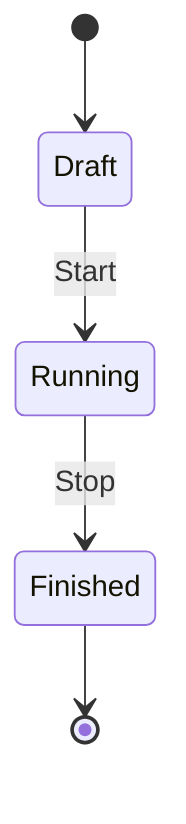

# First Measurement

Record your first experiment session and view real-time measurements.

---

## Overview

Sessions organize measurements into timed experiments. Each session:

- Is linked to a specific device
- Has a start and end time
- Automatically accumulates energy
- Can be compared with other sessions in [Benchmark](benchmark.md)

<!-- TODO: Replace with session lifecycle diagram -->

## Session Lifecycle



| Status | Description |
|--------|-------------|
| **Draft** | Session created but not yet started. No measurements are being recorded. |
| **Running** | Session is active. Measurements from the device are being recorded. |
| **Finished** | Session has ended. Measurements are frozen for analysis. |

!!! info "One session per device"
    Only one session can be running per device at a time. Starting a new session automatically stops any existing running session for that device.

## Step 1 — Create a Session

### Via Dashboard

1. Navigate to **Sessions** in the sidebar
2. Click **New Session**
3. Fill in the form:

| Field | Required | Description |
|-------|----------|-------------|
| **Name** | Yes | Descriptive name (e.g., "ESP32 Idle Test") |
| **Device** | Yes | Select the device to record from |
| **Target Device** | No | Device under test (e.g., "Raspberry Pi 4") |
| **Description** | No | Notes about the experiment |
| **Project** | No | Assign to a project |

4. Click **Save**

<!-- TODO: Replace with create session form screenshot -->

### Via API

```bash
curl -X POST http://localhost:8000/api/v1/sessions \
  -H 'Content-Type: application/json' \
  -H 'Authorization: Bearer <jwt-token>' \
  -d '{
    "name": "ESP32 Idle Test",
    "device_id": 1,
    "target_device": "Raspberry Pi 4",
    "description": "Measuring idle power consumption"
  }'
```

Response:

```json
{
  "id": 1,
  "device_id": 1,
  "device_name": "esp32-ina219-01",
  "name": "ESP32 Idle Test",
  "target_device": "Raspberry Pi 4",
  "description": "Measuring idle power consumption",
  "status": "draft",
  "project_id": null,
  "started_at": null,
  "ended_at": null,
  "created_at": "2026-07-18T10:00:00Z",
  "updated_at": "2026-07-18T10:00:00Z"
}
```

## Step 2 — Start the Session

### Via Dashboard

1. Navigate to **Sessions**
2. Find your session (status: **Draft**)
3. Click the **Start** button (play icon)

### Via API

```bash
curl -X POST http://localhost:8000/api/v1/sessions/1/start \
  -H 'Authorization: Bearer <jwt-token>'
```

Response:

```json
{
  "id": 1,
  "status": "running",
  "started_at": "2026-07-18T10:05:00Z"
}
```

!!! warning "Device must be online"
    Ensure your measurement node is connected and sending data before starting a session. Measurements from the device will be automatically assigned to the running session.

## Step 3 — View Live Measurements

Once the session is running:

1. Navigate to **Dashboard**
2. Select the session from the dropdown
3. Watch the live charts update every 5 seconds

<!-- TODO: Replace with live session screenshot -->

The dashboard shows:

- Real-time voltage, current, power, and energy charts
- Statistics cards with min/max/avg/peak values
- Energy breakdown by hour, day, week, month
- Recent measurements table

## Step 4 — Stop the Session

When your experiment is complete:

### Via Dashboard

1. Navigate to **Sessions**
2. Find your session (status: **Running**)
3. Click the **Stop** button (stop icon)

### Via API

```bash
curl -X POST http://localhost:8000/api/v1/sessions/1/stop \
  -H 'Authorization: Bearer <jwt-token>'
```

Response:

```json
{
  "id": 1,
  "status": "finished",
  "started_at": "2026-07-18T10:05:00Z",
  "ended_at": "2026-07-18T10:35:00Z"
}
```

## Step 5 — Review Results

After stopping the session:

1. Navigate to **Sessions**
2. Click on the session name to view details
3. Review the session statistics:

<!-- TODO: Replace with session detail screenshot -->

| Statistic | Description |
|-----------|-------------|
| **Duration** | Total session time |
| **Measurements** | Number of data points collected |
| **Avg Power** | Average power consumption |
| **Total Energy** | Cumulative energy consumed (Wh) |
| **Voltage Range** | Min/max voltage during session |
| **Current Range** | Min/max current during session |

## Session Management

### Editing a Session

1. Navigate to **Sessions**
2. Click the **Edit** button (pencil icon)
3. Modify name, description, target device, or project
4. Click **Save**

!!! info "Running sessions"
    You can edit session details while the session is running. Status and timestamps cannot be changed manually.

### Deleting a Session

1. Navigate to **Sessions**
2. Click the **Delete** button (trash icon)
3. Confirm the deletion

!!! danger "Permanent action"
    Deleting a session removes all associated measurements. This cannot be undone.

### Session List

The Sessions page shows all sessions with:

| Column | Description |
|--------|-------------|
| **Status** | Draft, Running, or Finished |
| **Name** | Session name |
| **Device** | Device name or ID |
| **Target** | Device under test |
| **Started** | Start timestamp |
| **Ended** | End timestamp |
| **Avg Power** | Average power (finished sessions) |
| **Energy** | Total energy (finished sessions) |

## Measurement Assignment

When a device sends a measurement:

1. BuckPow checks if the device has a **running** session
2. If yes, the measurement is assigned to that session
3. If no, the measurement is stored without a session association

This means:

- Start your session **before** the device begins sending data
- Stop your session **after** you've collected enough data
- Measurements outside a session are still stored but not linked to any experiment

## Energy Accumulation

Energy is calculated automatically:

```
Energy (Wh) = Power (W) × Sampling Interval (h)
```

For example, with a 1-second sampling interval:

```
Energy = 1.234 W × (1/3600) h = 0.000343 Wh per measurement
```

Cumulative energy is shown in the dashboard charts and session statistics.

## API Reference

| Method | Endpoint | Description |
|--------|----------|-------------|
| `GET` | `/api/v1/sessions` | List sessions (paginated) |
| `POST` | `/api/v1/sessions` | Create a new session |
| `GET` | `/api/v1/sessions/{id}` | Get session details |
| `PUT` | `/api/v1/sessions/{id}` | Update session |
| `DELETE` | `/api/v1/sessions/{id}` | Delete session |
| `POST` | `/api/v1/sessions/{id}/start` | Start session |
| `POST` | `/api/v1/sessions/{id}/stop` | Stop session |
| `GET` | `/api/v1/sessions/{id}/stats` | Get session statistics |

## Example Workflow

Here's a complete workflow for measuring Raspberry Pi power consumption:

### 1. Set Up Hardware

- Connect INA219 to ESP32
- Connect INA219 to Raspberry Pi power rail
- Upload firmware with correct `DEVICE_ID`

### 2. Create Session

```bash
curl -X POST http://localhost:8000/api/v1/sessions \
  -H 'Content-Type: application/json' \
  -H 'Authorization: Bearer <jwt-token>' \
  -d '{
    "name": "RPi4 Idle Test",
    "device_id": 1,
    "target_device": "Raspberry Pi 4",
    "description": "Idle power consumption with nothing running"
  }'
```

### 3. Start Session

```bash
curl -X POST http://localhost:8000/api/v1/sessions/1/start \
  -H 'Authorization: Bearer <jwt-token>'
```

### 4. Wait for Data

Let the Raspberry Pi idle for 5 minutes. The ESP32 sends measurements every second.

### 5. Stop Session

```bash
curl -X POST http://localhost:8000/api/v1/sessions/1/stop \
  -H 'Authorization: Bearer <jwt-token>'
```

### 6. View Results

Open the dashboard and select the session to see:

- Average power consumption
- Total energy consumed
- Voltage/current stability
- Any power spikes

### 7. Compare (Optional)

Run another session with a different workload, then use [Benchmark](benchmark.md) to compare:

```bash
curl "http://localhost:8000/api/v1/benchmark/compare?session_ids=1,2" \
  -H 'Authorization: Bearer <jwt-token>'
```
